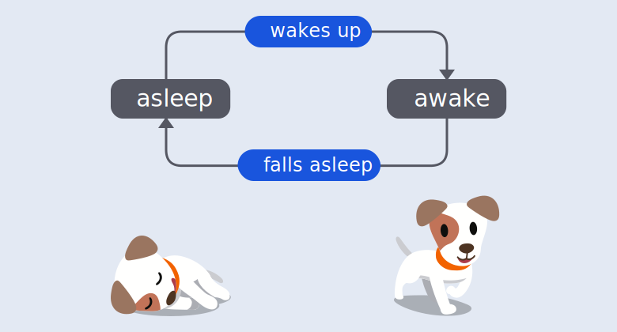

# **Final State Functions**

Never use "if" again. Prototype, test, and code.
**<u>[RED-GREEN-BLUE](https://blog.cleancoder.com/uncle-bob/2014/12/17/TheCyclesOfTDD.html)</u>**
as Uncle BoB says

<br/>

## Introduction

State machines are a useful concept in computer science and programming,
and are often used to model the behavior of systems. In this journey, I
explore this new way of programming to answer questions like what state
machines are, how they work, how can I implement them in my workflow.

A state machine is a mathematical model of computation that represents the
behavior of a system as a sequence of states and transitions between those
states. At any given time, a state machine is in a specific state, and when
certain conditions are met, it can transition to a new state.



> **_Simple Cute machine_**, image from
> [XState](https://xstate.js.org/docs/guides/introduction-to-state-machines-and-statecharts/#transitions-and-events)

<br/>

State machines can be implemented in a variety of ways, such as using a
switch statement or a series of if-else statements. In other hand, state
machines allow abstraction of methods/functions, guards (if-else) and
developpers can implement after defining the state machine, the logic of
the system. I used to say it's an industrial way to do programming in
opposition to the craftmanship model.

The "[XState](https://xstate.js.org/docs/)" library is the best
implementation of state machines. It goes a step further as they implement
state charts, where you can have events, children state machines, parallel
states for examples.

So I take inspiration of this library to create my own one only focus of
create of synchronous function. It's the only missing thing inside this
library.

I try my best to follow the syntax of XState, so you can use it can be used
with the
[Stately Editor](https://stately.ai/registry/discover?page=1&facetFilters=%255B%255D&numericFilters=%255B%255D)

<br />

## Features

|                             | **'@bemedev/fsf'** |
| --------------------------- | :----------------: |
| Finite states               |         ✅         |
| Initial state               |         ✅         |
| Transitions (object)        |         ✅         |
| Transitions (string target) |         ✅         |
| Delayed transitions         |         ❌         |
| Eventless transitions       |         ✅         |
| Nested states               |         ❌         |
| Parallel states             |         ❌         |
| History states              |         ❌         |
| Final states                |         ✅         |
| Context                     |         ✅         |
| Entry actions               |         ✅         |
| Exit actions                |         ✅         |
| Transition actions          |         ✅         |
| Parameterized actions       |         ✅         |
| Transition guards           |         ✅         |
| Parameterized guards        |         ✅         |
| Asynchronous                |         ❌         |
| Spawned actors              |         ❌         |

<br/>

#### **NB: Only for sync functions**

If you want to use statechart features such as nested states, parallel
states, history states, activities, invoked services, delayed transitions,
transient transitions, etc. please use
[<u>XState</u>](https://github.com/statelyai/xstate). <br/>

## Quick start

<br/>

### Installation

```bash
npm i @bemedev/fsf //or
yarn add @bemedev/fsf //or
pnpm add @bemedev/fsf
```

<br/>

### Usage (machine)

```ts
import { describe, expect, test } from 'vitest';
import { createLogic, interpret } from '@bemedev/fsf';

describe('#4: Complex, https query builder', () => {
  type Context = {
    apiKey?: string;
    apiUrl?: string;
    url?: string;
  };

  type Events = { products?: string[]; categories?: string[] };

  const queryMachine = createLogic(
    {
      schema: {
        context: {} as Context,
        // Add null option to make arguments optionals
        events: {} as Events | null,
        data: {} as string,
      },
      context: {},
      initial: 'preferences',
      states: {
        preferences: {
          always: {
            actions: ['setUrl', 'setApiKey', 'startUrl'],
            target: 'categories',
          },
        },
        categories: {
          always: [
            {
              cond: 'hasCategories',
              target: 'products',
              actions: 'setCategories',
            },
            'products',
          ],
        },
        products: {
          always: [
            {
              cond: 'hasProducts',
              target: 'final',
              actions: 'setProducts',
            },
            'final',
          ],
        },
        final: {
          data: 'query',
        },
      },
    },
    {
      strict: true,
      actions: {
        setApiKey: ctx => {
          ctx.apiKey = '123';
        },
        setUrl: ctx => {
          ctx.apiUrl = 'https://example.com';
        },
        startUrl: ctx => {
          const { apiUrl, apiKey } = ctx;
          ctx.url = `${apiUrl}?apikey=${apiKey}`;
        },
        setCategories: (ctx, { categories }) => {
          const _categories = categories?.join(',');
          ctx.url += `&categories=${_categories}`;
        },
        setProducts: (ctx, { products }) => {
          const _products = products?.join(',');
          ctx.url += `&categories=${_products}`;
        },
      },
      guards: {
        hasCategories: (_, { categories }) =>
          !!categories && categories.length > 0,
        hasProducts: (_, { products }) =>
          !!products && products.length > 0,
      },
      datas: {
        query: ctx => ctx.url,
      },
    },
  );

  const func = interpret(queryMachine);

  test('#1: no args', () => {
    // So here, arguments are optionals !
    expect(func()).toBe('https://example.com?apikey=123');
  });

  test('#2: categories', () => {
    expect(func({ categories: ['a', 'b'] })).toBe(
      'https://example.com?apikey=123&categories=a,b',
    );
  });

  test('#3: products', () => {
    expect(func({ products: ['a', 'b'] })).toBe(
      'https://example.com?apikey=123&categories=a,b',
    );
  });

  test('#4: categories and products', () => {
    expect(func({ products: ['a', 'b'], categories: ['c', 'd'] })).toBe(
      'https://example.com?apikey=123&categories=c,d&categories=a,b',
    );
  });
});
```

### **NB**: Please don't use version under 0.6.0, it's not stable.
